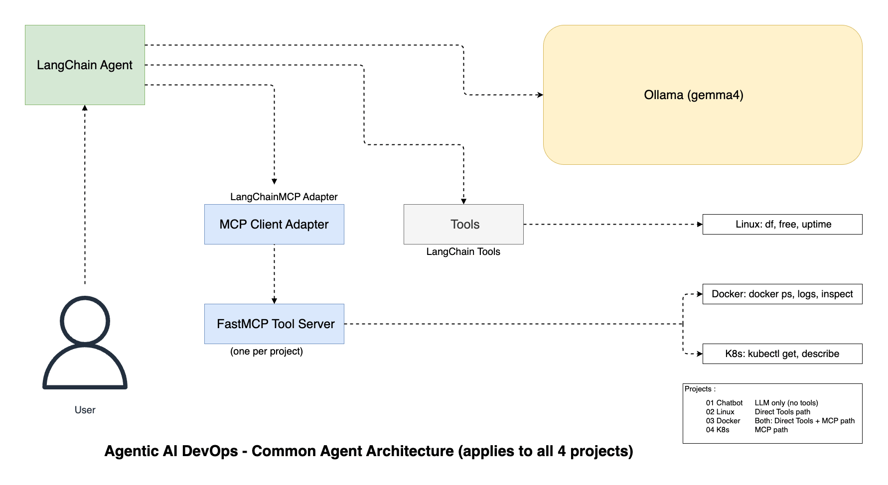
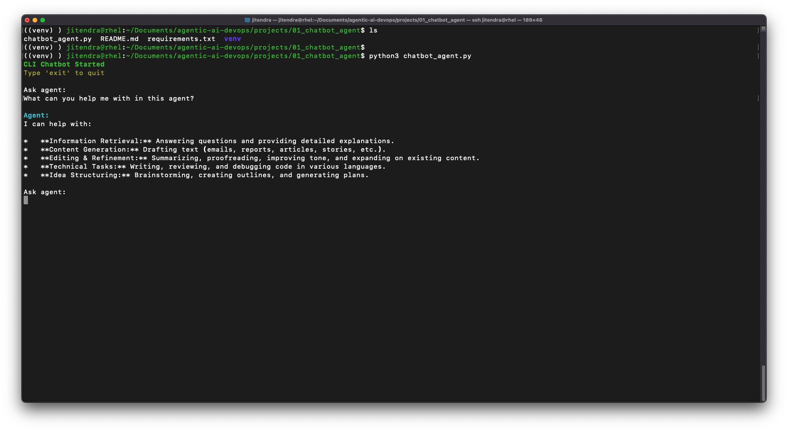
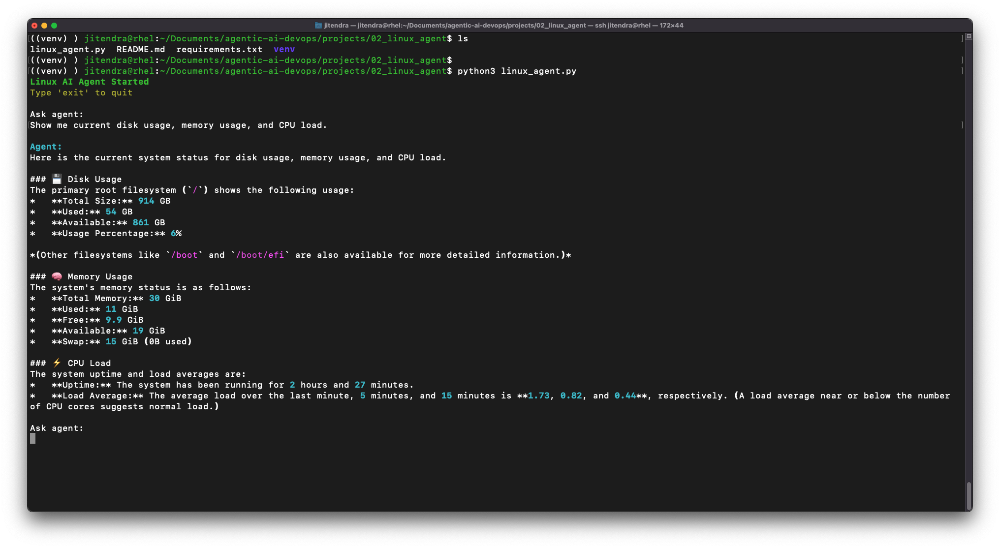
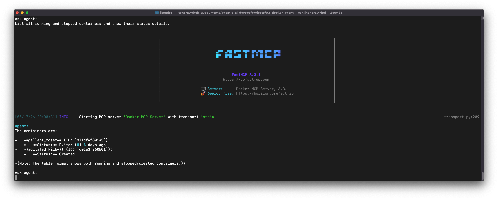

# Agentic AI DevOps

Production-grade AI agents for infrastructure automation, using local LLMs (Ollama), LangChain, and tool calling.

A collection of autonomous agents designed to interact with infrastructure, containers, and orchestration platforms—demonstrating practical AI-driven DevOps workflows without cloud dependencies.

## Projects Overview

| Project | Purpose | Key Tools | Models |
|---------|---------|-----------|--------|
| **[01 Chatbot Agent](./projects/01_chatbot_agent/)** | Foundational LLM integration | Python, Ollama, Rich | gemma4 |
| **[02 Linux Agent](./projects/02_linux_agent/)** | System monitoring & diagnostics | Disk/Memory/CPU tools | gemma4 |
| **[03 Docker Agent](./projects/03_docker_agent/)** | Container management | Docker CLI tools | gemma4 |
| **[04 K8s AIOps Agent](./projects/04_k8s_aiops_agent/)** | Kubernetes operations | kubectl tools | gemma4 |

## Architecture

<p align="center">
  
</p>


## Getting Started

### Prerequisites

- **Python 3.10+**
- **Ollama** – [Install](https://ollama.com)
- **macOS, Linux, or WSL2** on Windows
- **Docker** (for Docker Agent)
- **Kubernetes + kubectl** (for K8s Agent)

### Quick Setup

```bash
cd projects/01_chatbot_agent  # Choose any project

python -m venv .venv
source .venv/bin/activate
pip install -r requirements.txt

# In another terminal
ollama serve

# In the first terminal
ollama pull gemma4
python3 chatbot_agent.py  # or appropriate agent script
```

## Repository Structure

```
agentic-ai-devops/
├── projects/
│   ├── 01_chatbot_agent/           # Basic LLM chatbot
│   ├── 02_linux_agent/             # System monitoring
│   ├── 03_docker_agent/            # Container management
│   └── 04_k8s_aiops_agent/         # Kubernetes operations
└── README.md
```

## Technology Stack

| Component | Purpose |
|-----------|---------|
| **Ollama** | Local LLM runtime (privacy-first) |
| **LangChain** | Agent orchestration & tool calling |
| **FastMCP** | Model Context Protocol support |
| **Rich** | Terminal UI formatting |

## Core Capabilities

-  **Local Execution** – No cloud dependencies, full data privacy
-  **Tool Integration** – Agents can invoke system commands, APIs, and diagnostics
-  **Scalable Patterns** – MCP-based variants for production deployments
-  **Multi-Domain** – From basic chat to complex infrastructure automation

## Usage Examples

**Chatbot Agent**
```bash
cd projects/01_chatbot_agent
python3 chatbot_agent.py
# Type: What can you help me with in this agent?
```

**Linux Agent**
```bash
cd projects/02_linux_agent
python3 linux_agent.py
# Type: Show me current disk usage, memory usage, and CPU load.
```

**Docker Agent**
```bash
cd projects/03_docker_agent
python3 docker_agent.py
# Type: List all running containers and show their status.
```

**Kubernetes Agent**
```bash
cd projects/04_k8s_aiops_agent
python3 k8s_aiops_agent.py
# Type: List all pods in the default namespace and show their status.
```

## Key Concepts

- **Local LLMs** – Privacy-first AI with Ollama
- **Tool Calling** – Agents invoking system commands and APIs
- **Agent Pattern** – Autonomous decision-making and task execution
- **MCP** – Standardized agent-to-tool communication
- **AIOps** – AI-driven operations and remediation


## Additional Resources

Detailed setup and usage instructions for each project:

- **[01 Chatbot Agent](./projects/01_chatbot_agent/README.md)** – Foundation tutorial
- **[02 Linux Agent](./projects/02_linux_agent/README.md)** – System tools guide
- **[03 Docker Agent](./projects/03_docker_agent/README.md)** – Container ops guide
- **[04 K8s Agent](./projects/04_k8s_aiops_agent/README.md)** – Kubernetes guide

## Screenshots

**Chatbot Agent Overview**: Sample output from the chatbot agent during a simple conversation.
<p align="left">
	
</p>

**Linux Agent System Check**: Sample output from the Linux agent showing system health details.
<p align="left">
	
</p>

**Docker Agent Container List**: Sample output from the Docker agent listing container status details.
<p align="left">
	
</p>


